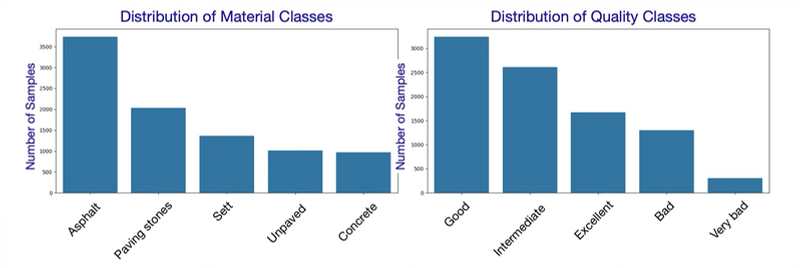

# RoadSafeAI: AI-Powered Road Damage Analysis

RoadSafeAI is an AI-powered system for analyzing road surface conditions and generating instant reports. It uses a multi-task model to classify street surface types and surface quality from images. The system supports imbalanced datasets, early stopping, and outputs confusion matrices and accuracy plots. The trained model can also be used to generate predictions on new road images.

The Streamlit application can be accessed at [https://roadsafe.streamlit.app/](https://roadsafe.streamlit.app/)

---

## Requirements
- Python 3.8+
- PyTorch
- torchvision
- torchsampler
- pandas
- pillow
- matplotlib
- seaborn

There is also a Streamlit web application in the `streamlit` folder that requires its own `requirements.txt` for running the app.

---

## Dataset
The dataset used for training can be downloaded from [Zenodo](https://zenodo.org/records/11449977).

**Class Distribution**  
The dataset is **imbalanced**: some surface material types (e.g., asphalt) and quality levels (e.g., good) have far more samples than others (e.g., concrete, very bad).  
To reduce this bias, we applied an **oversampling technique** during training, so that underrepresented classes contributed more equally to the learning process.



---

## Model Performance

EfficientNet-b7 achieved an accuracy of 88%.

During training and evaluation, the following results were observed:

- **Confusion Matrices (Validation Set)**  
  These show the model’s predictions versus the true labels:  
  - *Material*: frequent classes like **asphalt** are predicted more accurately than rarer ones such as **concrete** or **unpaged**.  
  - *Quality*: common categories like **good** and **intermediate** are recognized better than minority ones such as **very bad**.  

  

---

## Pretrained Model
The output of the trained model can be downloaded from [Hugging Face](https://huggingface.co/esdk/my-efficientnet-model/tree/main).

---

## How to Run Training

1. Clone the repository:
```bash
git clone https://github.com/eliesdk/my_project.git
cd my_project
```

2. Install dependencies:
```bash
pip install -r requirements.txt
```

3. Mount your Google Drive (if using Colab):
```python
from google.colab import drive
drive.mount('/content/drive')
```

4. Update the paths in `src/train.py`:
```python
CSV_PATH = "/content/drive/MyDrive/data/streetSurfaceVis_v1_0.csv"
IMG_DIR  = "/content/drive/MyDrive/data/s_1024"
```

5. Run training:
```bash
python src/train.py
```

6. Results:
- Best model checkpoint: `best_model.pt`
- Confusion matrices for validation set
- Accuracy per epoch plot

---

## Streamlit Web App
The project includes a Streamlit web application. The `streamlit` folder contains:
- `app.py` → Streamlit app code
- `city.csv` → Sample input data for the app
- `requirements.txt` → Dependencies for running the web app.

Run the app locally with:
```bash
streamlit run streamlit/app.py
```

---

## File Structure

- `src/` → Contains the four main Python files: `dataset.py`, `model.py`, `utils.py`, `train.py`
- `streamlit/` → Contains Streamlit web app files
- `README.md` → Project documentation
- `requirements.txt` → Project dependencies
